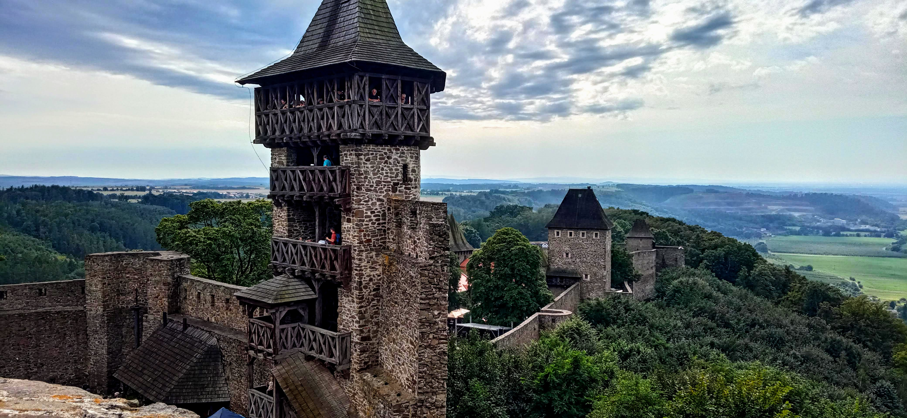

Letošní podzim je zatím od toho letošního velice rozdílný. Zatímco loni už jsme touto dobou topili v krbu, letos spíš větráme, aby nám nebylo příliš horko.

## Zahrada - moc jsme se letos nepředvedli, ale nevadí

V zahradě se nám příliš nepodařilo, vzhledem ke chladnému období v létě nedozrály rajčata ani dýně.Ty to ale snad ještě doženou, pokud bude teplé počasí ještě trochu trvat. Česnek je takový nedomrlý a cibule také. Asi budu muset letos věnovat větší úsilí přípravě půdy. V plánu je také užitkovou část zahrady rozšířit - bude místo i na brambory a další experimenty. Pokud to stihneme, chceme taky vybudovat pár **vyvýšených záhonů**, ke kterým časem vznikne kapková závlaha. Klima si neporoučí a klimatickým změnám se bude muset našinec holt přizpůsobit. A k tomu závlahový systém jednoznačně patří.

Ani ovocné stromy se letos moc nepředvedly. Měli jsme pár švestek - už jsou nasušené - a to je asi všechno. Ale celkově mi zahrada dělá radost, už tady vznikají útulná místa a přirozeně rostou i jednotlivé oblasti podle určení - rekreační část, užitková část, meditační část (místo,odkud je vidět do krajiny a na západy slunce) a kompostovací část,v níž je zatím neforemná hromada kompost, a vznikne zde kompostovací kadibudka, několik kompostérů a časem třeba i nějaký bioreaktor. 

Rajčata nám navíc v létě potlouklo krupobití - kroupy velké až 3 cm letěly ve vichřici téměř vodorovně. Odnesla to také fasáda domu, která ale byla udělaná blbě. Takže mě čeká ještě práce se stavebním lepidlem. Ale tu si nechám až bude přece jen trochu chladněji.

## Winter is comming

Každopádně dřevo je už dlouho pod střechou, ve skladu máme si železnou zásobu dřevních briket (jsou drahé, nechávám je, pokud by opravdu hodně mrzlo). Ve skladu je i metrák brambor, bednu cibule a bednu česneku. Takže zima bude hodně bramborová. Začínám uvažovat taky o pultovém mrazáku, protože se nám ty rýsují různé zdroje masa. A výhledově to bude chtít také **mlýnek na mouku** - ideálně jaký ruční, ale takový, ke kterému by se na posléze *dobastlit* nějaký druh motorového pohonu. A kupovat obilí (pšenice, žito) po pytlech.

## Hefaiston

Ještě v srpnu se nám podařilo navštívit akci Hefaiston. Jde o setkání kovářů z celého světa na hradě Helfštýn (fotka v úvodu). Akce samotná byla výborná. Už jen ten zvuk kovadlin a bucharů, doprovázený kouřem z uhlí měl něco do sebe. Jenom mě překvapilo, že ne úplně nízké vstupné nešlo platit kartou. A také množství stánků s různým *shitem* v podhradí. Samozřejmě, prodávaly se tu třeba pěkné šperky nebo potřeby pro kováře, ale celkově spíš nic, než moc. 

Obecně mě tato ekonomizace a komodifikace kulturních akcí trochu štve. Jasně stánky k nim asi patří,ale mám dojem,že se to často přehání. Navíc dost takových prodejců cílí hlavně na děti, a to mě vadí dvojnásob. Ale jinak pohoda, na Hefaiston se podíváme i příště.
